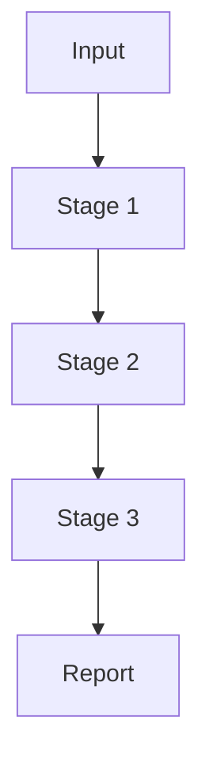

# Phage Analysis Pipeline - Workflow Diagram Outlines

This document contains detailed outlines for creating workflow diagrams for the README.

## Diagram Structure Overview

1. **High-level overview diagram** - For README top section (all stages at a glance)
2. **Phage ID/Prediction detailed** - Multi-tool approach
3. **Clustering detailed** - vClust 3-step process
4. **Analysis/Characterization detailed** - Complex parallel tracks with dependencies

---

## 1. HIGH-LEVEL OVERVIEW DIAGRAM

**Style**: Horizontal flow, clean and simple

```
┌─────────────────────────────────────────────────────────────────────────┐
│                              INPUT                                       │
│  ┌──────────────────┐              ┌──────────────────┐                 │
│  │ FASTA Assembly   │      OR      │ GFA Graph +      │                 │
│  │ (≥1KB contigs)   │              │ Raw Reads        │                 │
│  └──────────────────┘              └──────────────────┘                 │
│                                         │                                │
│                                         ▼                                │
│                              (Optional: Reneo binning)                   │
└─────────────────────────────────────────────────────────────────────────┘
                                    ▼
┌─────────────────────────────────────────────────────────────────────────┐
│                      STAGE 1: PHAGE IDENTIFICATION                       │
│                                                                           │
│  Initial Screening → Multi-Tool Prediction → Integration                 │
│  (MMseqs2)          (Jaeger, GeNomad,       (R script)                  │
│                      PHOLD, CheckV)                                      │
│                                                                           │
│  OUTPUT: High-confidence phage contigs                                   │
└─────────────────────────────────────────────────────────────────────────┘
                                    ▼
┌─────────────────────────────────────────────────────────────────────────┐
│                    STAGE 2: CLUSTERING (Optional)                        │
│                                                                           │
│  Filter (≥10KB) → vClust 3-step → Select Representatives                │
│                   (Prefilter/Align/Cluster)                             │
│                                                                           │
│  OUTPUT: vOTU representative sequences                                   │
└─────────────────────────────────────────────────────────────────────────┘
                                    ▼
┌─────────────────────────────────────────────────────────────────────────┐
│                  STAGE 3: COMPREHENSIVE ANALYSIS                         │
│                                                                           │
│  ┌──────────────┐  ┌──────────────┐  ┌──────────────┐                  │
│  │ Host         │  │ Taxonomy     │  │ Lifestyle    │                  │
│  │ Prediction   │  │ (Consensus)  │  │ Prediction   │                  │
│  │ (iPhop)      │  │ (3 tools)    │  │ (2 tools)    │                  │
│  └──────────────┘  └──────────────┘  └──────────────┘                  │
│                                                                           │
│  OUTPUT: Host assignments, Taxonomy, Lifestyle classifications           │
└─────────────────────────────────────────────────────────────────────────┘
                                    ▼
┌─────────────────────────────────────────────────────────────────────────┐
│                    STAGE 4: SUMMARY REPORT                               │
│                                                                           │
│  Collect results → Generate HTML report with visualizations              │
│                                                                           │
│  OUTPUT: Pipeline_Summary_Report.html                                    │
└─────────────────────────────────────────────────────────────────────────┘
```

**Key annotations to add:**
- Arrow from Stage 2 back indicating "(if clustering disabled, use all phages)"
- Note: "~100 sequences/chunk for parallel processing" in Stage 3

---

## 2. PHAGE IDENTIFICATION (Stage 1) - DETAILED

**Style**: Vertical flow with parallel branches that converge

```
┌─────────────────────────────────────────────────────────────────┐
│                        FILTERED CONTIGS                          │
│                         (≥1KB length)                            │
└────────────────────────────────┬────────────────────────────────┘
                                 ▼
                    ┌────────────────────────┐
                    │    INITIAL SCREENING   │
                    │                        │
                    │  MMseqs2 Taxonomy      │
                    │  (--sensitivity 4.0)   │
                    │                        │
                    │  Filter for:           │
                    │  • Viruses (10239)     │
                    │  • Unclassified (0)    │
                    │  • Root (1)            │
                    └───────────┬────────────┘
                                ▼
                    ┌────────────────────────┐
                    │  CANDIDATE VIRAL       │
                    │  CONTIGS               │
                    └───────────┬────────────┘
                                │
                ┌───────────────┼───────────────┐
                │               │               │
                ▼               ▼               ▼               ▼
        ┌─────────────┐ ┌─────────────┐ ┌─────────────┐ ┌─────────────┐
        │   Jaeger    │ │   GeNomad   │ │    PHOLD    │ │   CheckV    │
        │             │ │             │ │             │ │             │
        │ Neural Net  │ │ Viral       │ │ Functional  │ │ Quality     │
        │ Prediction  │ │ Detection   │ │ Annotation  │ │ Assessment  │
        │             │ │             │ │             │ │             │
        │ Score ≥2.5  │ │ Score ≥0.6  │ │ 1000 seq/   │ │ Completeness│
        │             │ │             │ │ chunk       │ │             │
        └──────┬──────┘ └──────┬──────┘ └──────┬──────┘ └──────┬──────┘
               │               │               │               │
               └───────────────┴───────────────┴───────────────┘
                                │
                                ▼
                    ┌────────────────────────┐
                    │  PREDICTION            │
                    │  INTEGRATION           │
                    │  (R script)            │
                    │                        │
                    │  Criteria:             │
                    │  • Functional div ≥3   │
                    │  • OR DTR/ITR/Provirus │
                    │  • OR Multi-tool       │
                    │    support             │
                    └───────────┬────────────┘
                                ▼
                    ┌────────────────────────┐
                    │  HIGH-CONFIDENCE       │
                    │  PHAGE CONTIGS         │
                    │  (phageContigs.fasta)  │
                    └────────────────────────┘
```

**Key annotations:**
- "PARALLEL EXECUTION" label for the 4-tool section
- Input/output file names at each stage
- Tool-specific thresholds clearly visible

---

## 3. CLUSTERING (Stage 2) - DETAILED

**Style**: Linear flow with 3-step process highlighted

```
┌─────────────────────────────────────────────────────────────────┐
│                   PHAGE CONTIGS (from Stage 1)                   │
└────────────────────────────────┬────────────────────────────────┘
                                 ▼
                    ┌────────────────────────┐
                    │   LENGTH FILTERING     │
                    │                        │
                    │   Minimum: 10KB        │
                    │   (configurable)       │
                    └───────────┬────────────┘
                                ▼
        ┌───────────────────────────────────────────────┐
        │         vClust THREE-STEP CLUSTERING          │
        │                                               │
        │   ┌─────────────────────────────────────┐    │
        │   │  STEP 1: PREFILTER                  │    │
        │   │                                      │    │
        │   │  • k-mer similarity screening       │    │
        │   │  • ≥20 common 25-mers               │    │
        │   │  • 95% identity threshold           │    │
        │   └──────────────┬──────────────────────┘    │
        │                  ▼                            │
        │   ┌─────────────────────────────────────┐    │
        │   │  STEP 2: ALIGN                      │    │
        │   │                                      │    │
        │   │  • Pairwise alignment               │    │
        │   │  • Filtered candidates only         │    │
        │   └──────────────┬──────────────────────┘    │
        │                  ▼                            │
        │   ┌─────────────────────────────────────┐    │
        │   │  STEP 3: CLUSTER                    │    │
        │   │                                      │    │
        │   │  • Leiden algorithm                 │    │
        │   │  • 95% identity (default)           │    │
        │   │  • 85% coverage (default)           │    │
        │   └──────────────┬──────────────────────┘    │
        └──────────────────┼───────────────────────────┘
                           ▼
                    ┌────────────────────────┐
                    │  REPRESENTATIVE        │
                    │  SELECTION             │
                    │                        │
                    │  Longest sequence per  │
                    │  cluster (vOTU)        │
                    └───────────┬────────────┘
                                ▼
                    ┌────────────────────────┐
                    │  vOTU REPRESENTATIVES  │
                    │  (vOTU_repSeqs.fasta)  │
                    └────────────────────────┘
```

**Key annotations:**
- "Optional Stage" banner at top
- Side note: "Used for downstream analysis if enabled"
- Parameters clearly labeled as "(default)" or "(configurable)"

---

## 4. COMPREHENSIVE ANALYSIS (Stage 3) - DETAILED

**Style**: Parallel tracks with dependency arrows, converging to consensus

```
┌─────────────────────────────────────────────────────────────────┐
│         PHAGE SEQUENCES (from Stage 1 or 2)                      │
│         Split into chunks of 100 for parallel processing         │
└─────────────────────────┬───────────────────────────────────────┘
                          │
        ┌─────────────────┼─────────────────┬────────────────────┐
        │                 │                 │                    │
        ▼                 ▼                 ▼                    ▼

┌──────────────┐  ┌──────────────┐  ┌──────────────┐  ┌──────────────┐
│   TRACK 1    │  │   TRACK 2    │  │   TRACK 3A   │  │   TRACK 3B   │
│              │  │              │  │              │  │              │
│   iPhop      │  │   Prodigal   │  │   MMseqs2    │  │   Phabox2    │
│              │  │              │  │              │  │              │
│ Host         │  │ Protein      │  │ Taxonomy     │  │ Taxonomy +   │
│ Prediction   │  │ Prediction   │  │              │  │ Lifestyle    │
│              │  │              │  │              │  │              │
│ • Parallel   │  │ • Metagenome │  │ • Sensitive  │  │ • ML-based   │
│   chunks     │  │   mode       │  │   search     │  │ • Both in    │
│ • Aggregate  │  │ • proteins.  │  │              │  │   one run    │
│              │  │   faa        │  │              │  │              │
└──────┬───────┘  └──────┬───────┘  └──────┬───────┘  └──────┬───────┘
       │                 │                 │                 │
       │                 │                 │                 │
       │                 └────────┐        │                 │
       │                          ▼        │                 │
       │                  ┌──────────────┐ │                 │
       │                  │   TRACK 3C   │ │                 │
       │                  │              │ │                 │
       │                  │  vContact3   │ │                 │
       │                  │              │ │                 │
       │                  │ Taxonomy     │ │                 │
       │                  │              │ │                 │
       │                  │ • DEPENDS:   │ │                 │
       │                  │   Prodigal   │ │                 │
       │                  │ • Gene-      │ │                 │
       │                  │   content    │ │                 │
       │                  │   clustering │ │                 │
       │                  └──────┬───────┘ │                 │
       │                         │         │                 │
       │                         └─────────┴─────────────────┘
       │                                   │
       │                                   ▼
       │                          ┌──────────────────┐
       │                          │   TAXONOMIC      │
       │                          │   CONSENSUS      │
       │                          │   (R script)     │
       │                          │                  │
       │                          │  • Hierarchical  │
       │                          │    integration   │
       │                          │  • Priority:     │
       │                          │    MMseqs2 >     │
       │                          │    Phabox2 >     │
       │                          │    vContact3     │
       │                          │  • Validates     │
       │                          │    consistency   │
       │                          └────────┬─────────┘
       │                                   │
       │        ┌──────────────────────────┘
       │        │
       │        │         ┌──────────────┐
       │        │         │   TRACK 4    │
       │        │         │              │
       │        │         │   BACPHLIP   │
       │        │         │              │
       │        │         │ Lifestyle    │
       │        │         │              │
       │        │         │ • DEPENDS:   │
       │        │         │   CheckV     │
       │        │         │   (Stage 1)  │
       │        │         │ • Adds       │
       │        │         │   complete-  │
       │        │         │   ness data  │
       │        │         └──────┬───────┘
       │        │                │
       ▼        ▼                ▼
┌────────────────────────────────────────┐
│       FINAL CHARACTERIZATION           │
│                                        │
│  ├─ Host predictions (genus level)    │
│  ├─ Consensus taxonomy                │
│  ├─ Lifestyle (temperate/virulent)    │
│  └─ Quality metrics                   │
└────────────────────────────────────────┘
```

**Key annotations:**
- "PARALLEL - INDEPENDENT" labels for Tracks 1, 2, 3A, 3B, 4
- "SEQUENTIAL - DEPENDS ON PRODIGAL" for Track 3C
- "SEQUENTIAL - DEPENDS ON 3A, 3B, 3C" for Consensus
- Dashed lines for dependencies vs solid lines for data flow
- Color coding suggestion:
  - Green for independent tracks
  - Yellow for tracks with dependencies
  - Blue for integration/consensus steps

---

## Visual Design Recommendations

### Colors
- **Stage 1 (Identification)**: Blue tones
- **Stage 2 (Clustering)**: Green tones
- **Stage 3 (Analysis)**: Orange/Purple tones
- **Stage 4 (Report)**: Gray tones

### Icons to Consider
- DNA/helix for sequences
- Magnifying glass for screening/prediction
- Network/nodes for clustering
- Target/bullseye for host prediction
- Family tree for taxonomy
- Lifecycle symbol for lifestyle

### Format Suggestions
1. **Mermaid** - For easy GitHub rendering (directly in markdown)
2. **draw.io / Lucidchart** - For more polished, professional diagrams
3. **Export as SVG** - For crisp scaling at any resolution

---

## Implementation Notes

### For GitHub README
- Place high-level diagram near the top (after title/intro)
- Add detailed diagrams in expandable sections or link to this document
- Consider using HTML details/summary tags for collapsible sections:

```html
<details>
<summary><b>Stage 1: Phage Identification (Click to expand)</b></summary>

[Insert detailed diagram here]

</details>
```

### Mermaid Example (for reference)
If you want to convert these to Mermaid syntax for direct markdown rendering, the format would be:



### Tools for Creating Diagrams
- **Mermaid Live Editor**: https://mermaid.live/
- **draw.io**: https://app.diagrams.net/
- **Lucidchart**: https://www.lucidchart.com/
- **Excalidraw**: https://excalidraw.com/ (hand-drawn style)
