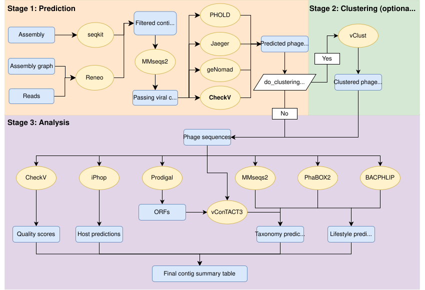

# Phage Analysis Pipeline

A comprehensive Snakemake workflow for identifying, clustering, and characterizing phages from metagenomic assemblies.

## Pipeline Overview



## Features

- **Multi-tool phage prediction**: Jaeger, geNomad, PHOLD, CheckV
- **Optional graph-based assembly processing**: Reneo integration for improved contig binning
- **Viral clustering**: Group similar phages into vOTUs (optional)
- **Host prediction**: Identify bacterial hosts using iPhop
- **Lifestyle prediction**: Classify phages as temperate/virulent using BACPHLIP and Phabox2
- **Taxonomic classification**: Multiple approaches via MMseqs2, Phabox2, and vContact3
- **Taxonomic consensus**: Hierarchical integration of taxonomy predictions from multiple tools
- **Functional annotation**: Protein prediction and annotation
- **Per-sample abundance**: Calculate phage and ORF abundance across samples using CoverM (optional)
- **Progress tracking**: Automated summary collection and HTML report generation

The pipeline includes a robust taxonomic consensus system that combines predictions from MMseqs2 (protein similarity), Phabox2 (ML-based), and vContact3 (gene content), with automatic format detection and hierarchical validation. For detailed technical information, see [WORKFLOW_SUMMARY.md](WORKFLOW_SUMMARY.md).

## Requirements

- Snakemake version 8+
- [Mamba](https://anaconda.org/conda-forge/mamba) for environment management
- [snakemake-executor-plugin-slurm](https://snakemake.github.io/snakemake-plugin-catalog/plugins/executor/slurm.html) for SLURM execution
- For Reneo (GFA) workflow: Gurobi license

## Installation

```bash
# 1. Clone repository
git clone https://github.com/megjohnson1999/phage-analysis.git
cd phage-analysis

# 2. Create conda environment
conda create -n phage-pipeline python=3.11
conda activate phage-pipeline

# 3. Install Snakemake and dependencies
conda install -c conda-forge -c bioconda snakemake=8 mamba
pip install snakemake-executor-plugin-slurm

# 4. Database Setup

The pipeline requires several databases for phage prediction and analysis.

Download databases to a central location and configure paths in your config file:

```bash
# Create database directory
mkdir -p /path/to/your/databases

# GeNomad database (~6GB, ~30 min download)
genomad download-database /path/to/your/databases/genomad_db

# CheckV database (~3GB, ~15 min download)
checkv download-database /path/to/your/databases/checkv_db

# iPhop database (~120GB, ~3-6 hours download)
iphop download --out_dir /path/to/your/databases/iphop_db

# Phabox2 database (~2GB, ~10 min download)
# Follow instructions at: https://github.com/KennthShang/PhaBox2

# vContact3 database (~15GB, ~1 hour download)
# Follow instructions at: https://github.com/vcontact/vcontact3
```

Then update your config file with the correct paths:
```yaml
databases:
  genomad:
    db: "/path/to/your/databases/genomad_db"
  checkv:
    db: "/path/to/your/databases/checkv_db"
  # ... etc
```

## Database Validation

Before running the pipeline, validate your database setup:

```bash
# Check if databases exist and are accessible
ls -la /path/to/your/databases/

# Test genomad database specifically
genomad --help  # Should show available commands
```

## Troubleshooting Database Issues

- **"Path does not exist" errors**: Check database paths in your config file
- **Permission denied**: Ensure read access to database directories
- **Download failures**: Check internet connection and disk space (total: ~150GB)
- **For HPC systems**: Ask your administrator about existing institutional databases
```

## Quick Start

### 1. Copy and Edit Configuration File

```bash
# Copy the example config
cp config/config.yaml config/my_config.yaml

# Edit with your paths (see Configuration section below for details)
nano config/my_config.yaml  # or use your preferred editor
```

**Key settings you MUST change:**
- `output_dir`: Where to save results
- `assembly_file` OR `assembly_graph`: Your input file (provide one, not both)
- `reads_dir`: Directory containing your FASTQ read files
- All database paths under `databases:` section

**Optional settings:**
- `do_clustering: false` - Skip clustering to speed up analysis
- SLURM resources in `profile/slurm/config.yaml`

### 2. Run the Pipeline

**Tip**: Use `screen` or `tmux` to keep the pipeline running if your SSH connection drops!

```bash
# Start a screen session
screen -S phage_run

# Navigate to workflow directory
cd phage-analysis/workflow

# Run with your config file
snakemake --profile ../profile/slurm --configfile ../config/my_config.yaml

# Detach from screen: Ctrl+A, then D
# Reattach later: screen -r phage_run
```

**Additional options:**
```bash
# Dry run to preview what will be executed
snakemake -n --profile ../profile/slurm --configfile ../config/my_config.yaml

# Local execution without SLURM
snakemake --use-conda --cores 8 --configfile ../config/my_config.yaml

# Override config values from command line (if needed)
snakemake --profile ../profile/slurm --configfile ../config/my_config.yaml \
  --config do_clustering=false
```

## Configuration

### Minimal Configuration

Edit `config/my_config.yaml` with your paths:

```yaml
# Output directory
output_dir: "/path/to/outputs"

# Input (provide ONE of these)
assembly_file: "/path/to/assembly.fasta"    # For FASTA workflow
assembly_graph: ""                          # Or GFA path for Reneo

# Required
reads_dir: "/path/to/reads/"

# Optional
do_clustering: true                         # Set false to skip clustering
calculate_abundance: false                  # Set true to calculate contig and ORF abundance
abundance_coverage_threshold: 0.75          # Min coverage to count abundance (0.0-1.0)
cleanup_temp_dirs: true                     # Set false to keep intermediate temp files (saves space but removes flexibility for partial reruns)

# Entry point configuration (skip expensive upstream steps)
start_from: "assembly"                      # Options: assembly, reneo_output, viral_contigs, predicted_phages, clustered_sequences
# Entry point input files (provide the one matching your start_from setting):
# reneo_output_file: "/path/to/reneo_contigs.fasta"
# viral_contigs_file: "/path/to/viral_contigs.fasta"
# predicted_phages_file: "/path/to/predicted_phages.fasta"
# clustered_sequences_file: "/path/to/vOTUs.fasta"

# Database paths (update these!)
databases:
  checkv:
    db: "/path/to/checkv-db"
  genomad:
    db: "/path/to/genomad_db"
  # ... see config/config.yaml for all databases
```

### Flexible Entry Points

The pipeline supports starting from different stages, allowing you to skip expensive upstream steps if you already have intermediate results:

| Entry Point | Input Required | Skips | Runs |
|-------------|---------------|-------|------|
| **`assembly`** (default) | Assembly file or graph | Nothing | Everything |
| **`reneo_output`** | Reneo-binned contigs (FASTA) | Reneo binning | Filtering → Prediction → Clustering → Analysis |
| **`viral_contigs`** | Viral contigs (FASTA) | Filtering + Reneo | Prediction → Clustering → Analysis |
| **`predicted_phages`** | Predicted phage contigs (FASTA) | Filtering + Prediction | Clustering → Analysis |
| **`clustered_sequences`** | vOTU representatives (FASTA) | Filtering + Prediction + Clustering | Analysis only |

**Example Usage:**

```yaml
# Start from predicted phages (skip expensive prediction step)
start_from: "predicted_phages"
predicted_phages_file: "/path/to/my_predicted_phages.fasta"
reads_dir: "/path/to/reads"  # Still needed for abundance

# Standard settings still apply
do_clustering: true           # Will cluster your phages into vOTUs
calculate_abundance: true     # Optional - calculate per-sample abundance
generate_summaries: true      # Generate HTML report
```

**Input File Requirements:**
- FASTA format with nucleotide sequences
- Minimum sequence length: 1000 bp
- Unique sequence IDs (no duplicates)
- For `clustered_sequences`: provide vOTU representative sequences

**See Also:**
- `config/examples/config_from_reneo_output.yaml` - Example for starting from Reneo output
- `config/examples/config_from_predicted_phages.yaml` - Example for starting from predictions
- `config/examples/config_from_clustered_sequences.yaml` - Example for starting from vOTUs

### SLURM Configuration

Edit `profile/slurm/config.yaml` for your HPC cluster:
- Adjust `default-resources` (memory, runtime, CPUs)
- Set `slurm_account` to your account name

See `config/config.yaml` for all available options and detailed comments.

## Key Output Files

The pipeline generates organized results in your specified `output_dir`:

**Main Results:**
- **`final_contig_summary.tsv`** - Comprehensive table with all annotations (contig info, phage predictions, CheckV quality, taxonomy consensus, lifestyle, host predictions)
- **`Pipeline_Summary_Report.html`** - Interactive HTML report with statistics, progress tracking, and visualizations

**Detailed Results:**
- `01_phage_predictions/phageContigs.fasta` - Predicted phage sequences
- `01_phage_predictions/viral_contigs_summary.tsv` - All viral contigs with pass/fail status and prediction details
- `02_clustering/vOTU_repSeqs.fasta` - Representative sequences per vOTU (if clustering enabled)
- `03_checkv_final/quality_summary.tsv` - Quality metrics
- `03_genomic_info/consensus_taxonomy.tsv` - Integrated taxonomy from multiple tools
- `03_genomic_info/lifestyle_consensus.tsv` - Lifestyle predictions (BACPHLIP + Phabox2)
- `03_iphop_results/iphop_predictions_compiled.tsv` - Host predictions

**Abundance Outputs** (when `calculate_abundance: true`):
- `04_abundance/tpm_matrix.tsv` - Contig TPM abundance (contigs × samples)
- `04_abundance/count_matrix.tsv` - Contig read counts (contigs × samples)
- `04_abundance/orf_tpm_matrix.tsv` - ORF TPM abundance (ORFs × samples)
- `04_abundance/orf_count_matrix.tsv` - ORF read counts (ORFs × samples)
- `04_abundance/orf_annotations.tsv` - ORF metadata linking to contigs

**To view the HTML report:**
```bash
# On your local machine after copying from cluster
open Pipeline_Summary_Report.html

# Or copy from cluster
scp user@cluster:/path/to/output_dir/Pipeline_Summary_Report.html .
```

## Disk Space Management

The pipeline automatically cleans up large temporary files when `cleanup_temp_dirs: true` (default):

**What gets cleaned:**
- `01_reneo_output/temp/` - BAM files and coverage intermediate files
- `01_reneo_output/work/` - Reneo workflow intermediate files
- `03_iphop_results/tmp/` - Individual iPhop prediction files per sample

**When cleanup happens:**
- After successful completion of each step
- Only after final outputs are verified
- Logged in rule-specific log files

**Trade-offs:**
- ✓ **Enabled** (default): Saves significant disk space (especially with many samples)
- ✓ **Disabled** (`cleanup_temp_dirs: false`): Allows cheaper partial reruns if aggregation fails

**Note:** If temp files are deleted and you need to rerun a step, Snakemake will automatically regenerate them from the previous step. For example, deleting `iphop_predictions_compiled.tsv` will trigger re-running all iPhop predictions (not just aggregation).

## Troubleshooting

**Memory/Time Issues**
```bash
# Increase resources for specific rules
snakemake --profile ../profile/slurm \
  --set-resources iphop_single_prediction:mem_mb=100000 \
                  iphop_single_prediction:runtime=2880
```

**Reneo Issues**
- Check Gurobi license: `python -c "import gurobipy"`
- Review `logs/reneo_binning.log`
- Pipeline continues if virus detection fails

**Empty Results**
- Verify input file quality and minimum contig lengths
- Check logs in `output_dir/logs/` for tool-specific errors
- Ensure databases are downloaded and paths are correct

**Database Errors**
- Verify all database paths in config file
- Check database versions match tool requirements
- Ensure sufficient disk space for databases and outputs

## Support

- **Issues**: [GitHub Issues](https://github.com/megjohnson1999/phage-analysis/issues)
- **Documentation**: See [WORKFLOW_SUMMARY.md](WORKFLOW_SUMMARY.md) for detailed technical information
- **Test Data**: Example configuration and data in `test_data/` directory

## Citation

If you use this pipeline, please cite:
- The individual tools used (see citations in tool documentation)
- This pipeline: [GitHub repository](https://github.com/megjohnson1999/phage-analysis)

## License

This project is licensed under the MIT License - see the [LICENSE](LICENSE) file for details.
